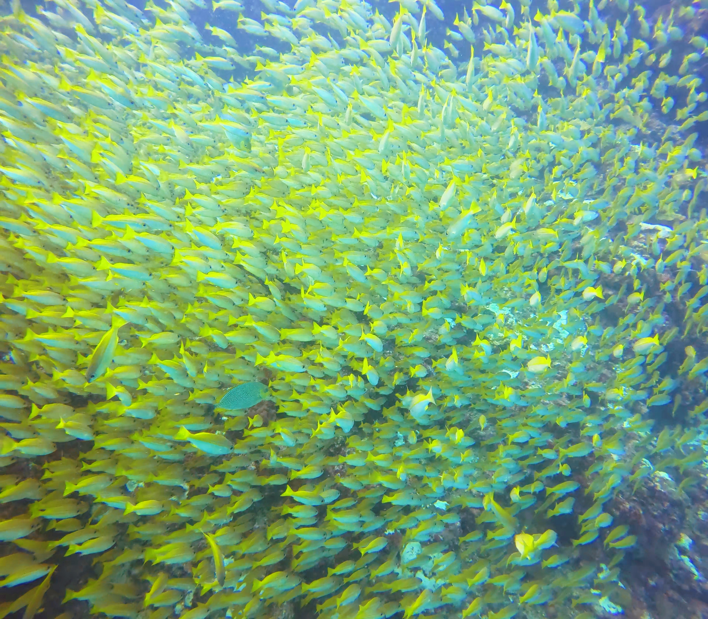
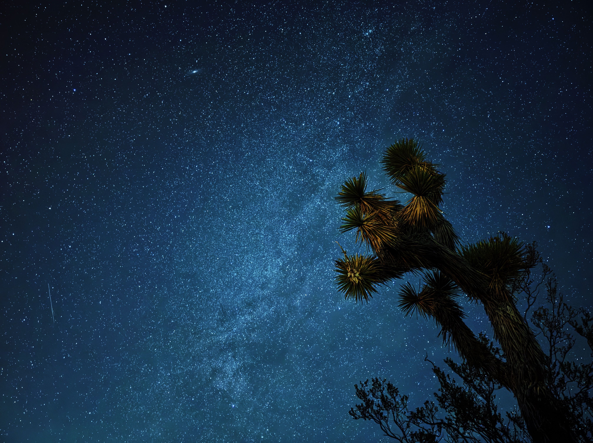

<!-- Personal splash 👋 -->
<div align="center">

  

  <h1>Hey, I'm Sean ✨</h1>

  <p>Shanghai‑born • Cornell ORIE M.Eng. • Data whisperer</p>

  <p><em>A wanderer who thinks sleep is for the dead.</em></p>

</div>


---

## TL;DR

```text
📍 Currently      Ithaca / NYC
🎓 Day Job        Turning math into decisions @ Cornell ORIE
🏗️ Side Quests    LLMs • ML Ops • Data Viz
🎮 Hobby Grind    Gaming • Skiing • Traveling • Working out
🌊 Happy Place    120 ft below sea level, chasing turtles
```

---

## 💡 Skills

| Languages & Libraries                                       | Data & Cloud                                                  | Visualization                            |
| ----------------------------------------------------------- | ------------------------------------------------------------- | ---------------------------------------- |
| Python (PyTorch, TensorFlow, Scikit‑Learn) • SQL • R • Java | Azure (Synapse, ADLS2, SSMS) • Hadoop (HDFS, Hive, MapReduce) | Power BI • Tableau • Excel (PivotTables) |


---

## 🔬 Project Spotlight

### **OnlySportsLM — tiny model, big game IQ**

Ever wondered if a sub‑1 B model could talk sports better than the giants? We gave it a try.

* **Dataset →** scraped & filtered **600 B tokens** of play‑by‑play, news, and forum banter.
* **Model →** custom **196 M‑parameter RWKV‑v6**, 20 layers × 640 dims (deep‑and‑thin FTW).
* **Training →** half the dataset on 8 H100s.
* **Result →** beats previous 135 M/360 M baselines by **+37.6 % accuracy** on our open benchmark, nipping at the heels of 1 B+ models.

📄 **Paper:** [NeurIPS 2024 ENLSP Workshop · Paper 21](https://neurips2024-enlsp.github.io/papers/paper_21.pdf)

💻 **Code:** [GitHub Repo](https://github.com/chrischenhub/OnlySportsLM)

*Ping me if you want to tinker with checkpoints or the data pipeline.*

---

## 🌍 Travel Gallery

<style>
  /* ---------- Travel Gallery ---------- */
  .travel-grid {
    display: grid;
    grid-template-columns: minmax(280px, 1fr) minmax(280px, 1fr); /* 2 columns */
    gap: 1rem;
    /* ❶ let rows size themselves to content (image + caption) */
    grid-auto-rows: auto;
  }

  .travel-grid figure {
    margin: 0;
    text-align: center;
  }

  /* ❷ left‑column images get a fixed height so rows stay even */
  .travel-grid img {
    width: 100%;
    height: 200px;              /* tweak if you want taller/thinner tiles */
    object-fit: cover;
    border-radius: 6px;
  }

  /* ❸ beam shot spans 3 of those auto‑height rows */
  .beam {
    grid-row: span 3;
    display: flex;              /* keeps caption under the tall image */
    flex-direction: column;
  }
  .beam img {
    flex: 1 0 auto;             /* fill all vertical space it gets */
    height: auto;               /* override the 200 px rule above */
  }

  .travel-grid figcaption {
    margin-top: 0.4rem;
    font-size: 0.85rem;
    line-height: 1.25;
  }

  /* ❹ Mobile: fall back to a single column */
  @media (max-width: 700px) {
    .travel-grid {
      grid-template-columns: 1fr;
    }
    .beam {
      grid-row: span 1;         /* no spanning needed in one column */
    }
    .beam img {
      height: 200px;            /* keep reasonable height on phones */
    }
  }
</style>

<div class="travel-grid">

  <!-- Row 1 – left -->
  <figure>
    
    <figcaption><strong>Phuket, Thailand</strong><br/>Yellow snappers swirling in the blue</figcaption>
  </figure>

  <!-- Rows 1‑3 – right -->
  <figure class="beam">
    
    <figcaption><strong>Cenote Siete Bocas, Mexico</strong><br/>Sunbeams piercing the abyss</figcaption>
  </figure>

  <!-- Row 2 – left -->
  <figure>
    
    <figcaption><strong>Tibetan Plateau, China</strong><br/>First light painting the peaks</figcaption>
  </figure>

  <!-- Row 3 – left -->
  <figure>
    
    <figcaption><strong>Joshua Tree, USA</strong><br/>Milky Way shimmering above the yuccas</figcaption>
  </figure>

</div>


---

## 🎮 Gamer Corner

* **Platforms:** PS5 • Switch • PC
* **Genre comfort food:** Souls‑likes, bullet‑hell, roguelikes
* **Current obsession:** Dropping into *HELLDIVERS 2* lobbies yelling “For Super Earth!” 🤘

---

## 📬 Get in Touch

* 📧 **Email:** [seanxie249@gmail.com](mailto:seanxie249@gmail.com)
* 💼 **LinkedIn:** [linkedin.com/in/seanxie2024/](https://www.linkedin.com/in/seanxie2024/)
* 🛠️ **GitHub:** [github.com/XYCrus](https://github.com/XYCrus)

Feel free to reach out for collaboration, research opportunities, or just to talk about AI! 🌟

---

© 2025 Xiangyu (Sean) Xie | Built with ❤️ using GitHub Pages
